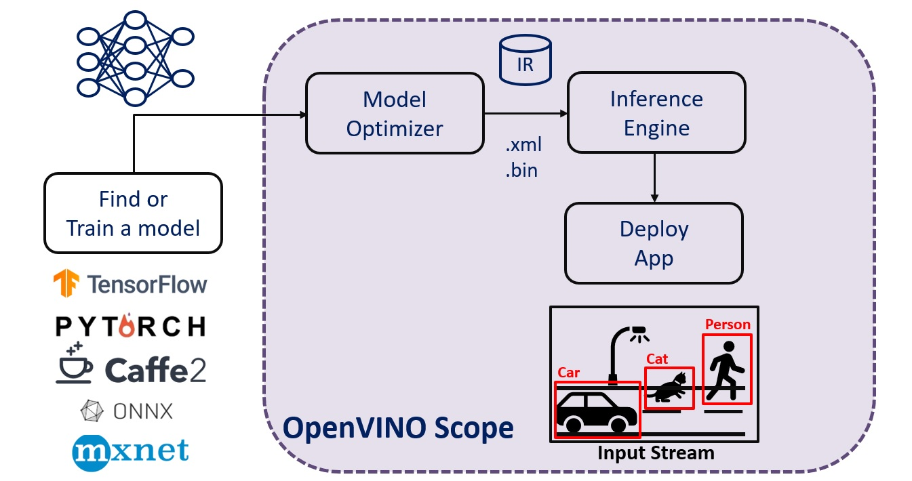
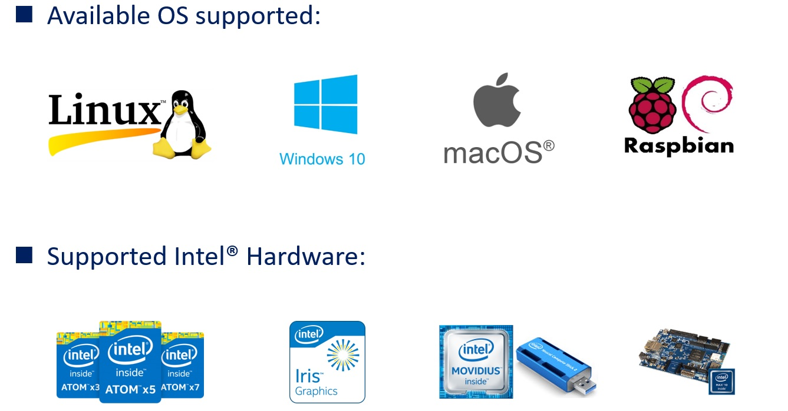

# OpenVINO_QuickStart
Today, everybody talks about Artificial Intelligence (AI). It is growing rapidly and its market is on fire.  OpenVINO is a power toolkit that that you can easily develop and deploy AI solutions with Intel® platforms, on the Cloud or on the Edge.  Following the repository instruction to quickly kick-start your AI journey!

- What is OpenVINO?

  - OpenVINO stands for Open Visual Inferencing and Neural Network Optimization. It is a toolkit that you can develop and deploy computer vision oriented solutions on Intel® platforms, on the Cloud or on the Edge.

## Inference Engine

### What is the Inference Engine?

- Optimized for Intel® hardware.
  - It provides hardware-based optimizations to get even further improvements from a model.
  
- Running the actual inference at the edge.
  - It only works with the Intermediate Representation (IR) files.
  - They (IR) are come from Intel® Open Model Zoo. Or we can produce them from the Model Optimizer.

- Consists of a high-level API so that we can utilize on the edge application easily.
  - It is built with C++ for faster operations.
  - We can use the built-in Python wrapper to work with the inference engine.

